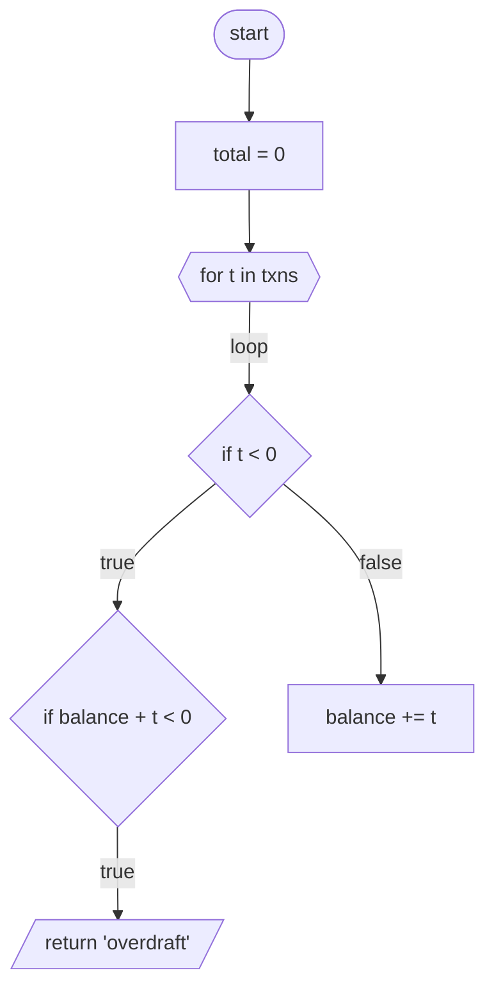

# Control-Flow Graphs — the logic *inside* a routine (Tier-2 block scheme)

**Date:** 2026-07-03 · **Module:** `src/uci/analysis/cfg.py` · **Eval:** `evals/cfg_eval.py`

Where the graph shows *how programs connect* (calls, data, screens — the flow-level block scheme),
a **control-flow graph (CFG)** shows *how one routine decides* — its branches, loops, and returns as
a block scheme you can read as logic. This is the "full understanding of the logic inside" layer.

## What it is (and isn't)

- **Deterministic, on-demand analysis** — computed from source when asked (like `walkthrough` /
  `architecture`), **not persisted** as graph entities. So it never bloats the canonical graph, and
  every node cites a source line. (Promoting hot CFGs into the graph is a future option.)
- **Parsed fact, with optional narration.** No LLM in the *structure*. An optional LLM pass
  (`--narrate`) *labels* blocks in business terms — attached as node `note` fields — but can never
  invent or change control flow: ids it returns are validated against the real graph and hallucinated
  ones dropped (same honesty contract as the rest).
- **Per-language builders, one model:**
  - **Python** — stdlib `ast`, fully faithful (`if/elif/else`, `while`/`for` + `break`/`continue`,
    `match/case`, `with`, `try/except/finally`).
  - **COBOL** — procedure-division statement-level: `IF/ELSE/END-IF`, `EVALUATE/WHEN`, `PERFORM …
    UNTIL` loops, inline `PERFORM … END-PERFORM`, `GO TO`, `GOBACK`/`STOP RUN`, paragraph
    fall-through, and `PERFORM` shown as a call into its paragraph. Targets well-structured code
    (explicit scope terminators); deeply nested period-only scoping is approximated.
  - **HLASM** — basic-block CFG from raw source: blocks split at labels/after branches; edges from the
    branch family (`B`/`J` branch, conditional `BE/BNE/…` → `taken`/`fall`, `BAL`/`BALR` calls, `BR
    R14` return). Macros and conditional assembly are **not** expanded — that needs the Che4z HLASM
    LSP (roadmap); the raw-source CFG is honest about what it sees.
  - **JS/TS** — still blocked: the JavaScript parser is regex-based (no AST), so a faithful CFG isn't
    extractable yet. Needs a real parser (tree-sitter or the TS compiler). See
    `lsp-refactoring-recommendations.md` for per-language feasibility.

## Model

| Node kind | Meaning | Mermaid shape |
| --- | --- | --- |
| `entry` / `exit` | start / end | stadium `([…])` |
| `decision` | `if` / `match` branch point | rhombus `{…}` |
| `loop` | `while` / `for` header | hexagon `{{…}}` |
| `call` | bare call statement | subroutine `[[…]]` |
| `return` / `raise` | terminates the routine | parallelogram `[/…/]` |
| `break` / `continue` | loop control | parallelogram |
| `statement` | anything else | rectangle `[…]` |

Edge labels carry the branch semantics: `true` / `false` (decisions), `loop` / `exit` (loop
header), `case …` (match), `when …` (COBOL `EVALUATE`), `perform` (COBOL `PERFORM` → its paragraph),
`except …` (try). A `while`/`for`/`PERFORM UNTIL` header gets a **back-edge** from the end of its body
and an `exit` edge to what follows; `return`/`raise`/`GOBACK` connect straight to `exit`; `continue`
targets the loop header; `break` targets the after-loop node; `GO TO` transfers to the target
paragraph; consecutive COBOL paragraphs fall through, per COBOL semantics.

## Use it

```bash
uci cfg <routine>             # Mermaid flowchart of the routine's logic (Python fn / COBOL/HLASM program)
uci cfg <routine> --json      # nodes, edges, per-kind stats, and the Mermaid string
uci cfg <routine> --narrate   # + optional LLM business-language notes per block (needs an LLM)
```

Surfaces: `uci cfg`, the `control_flow` **MCP tool** (structured JSON for agents; deterministic — no
narration in the MCP path), `Engine.control_flow(symbol, narrate=…)`, and the **dashboard** — the
symbol page shows a *Control flow* block scheme (renders as a diagram when `mermaid.js` is present in
`static/`, source otherwise, so airgapped installs still work).

Example (`uci cfg post`):



## Correctness — the eval

`evals/cfg_eval.py` runs the builders over fixtures covering every construct family — Python
(`if/elif/else`, `while` + `break`/`continue`, `match/case`, `try/finally`) and COBOL
(`IF/ELSE/END-IF`, `EVALUATE/WHEN`, out-of-line `PERFORM UNTIL`, inline `PERFORM … END-PERFORM`,
`GO TO`, `GOBACK`, fall-through) — and checks the invariants a correct CFG must satisfy: single
entry/exit, **full reachability both ways** (every node is reachable from entry and can reach exit),
well-formed decision forks (`true`+`false`), and loop wiring (back-edge + exit) — plus per-fixture
golden counts. It scores **100/100** and is CI-gated by `tests/test_cfg_eval.py`. Adding a language
means adding a builder + fixtures to the same harness.

## Next

1. **JS/TS** — blocked on a real parser (tree-sitter or the TS compiler / an LSP-AST source); the
   regex parser can't yield a faithful CFG.
2. **HLASM macro expansion** — a *faithful* HLASM CFG needs the Che4z HLASM LSP's conditional-assembly
   evaluation; today's builder is raw-source basic blocks.
3. **Vendored `mermaid.js`** — drop the minified file into `static/` for in-dashboard diagram
   rendering without any network (the page already looks for it).
4. **CFG in the graph** — optionally persist hot CFGs so impact analysis can answer "what logic
   guards this call?" (currently on-demand only).
