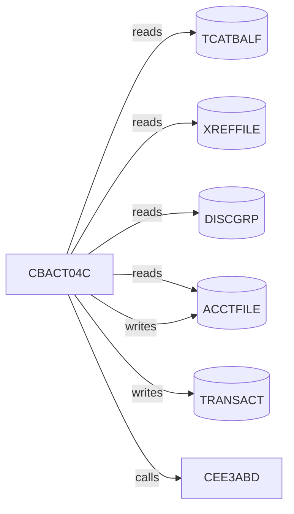

# Migration-unit issue — worked example (MIGUNIT-CBACT04C)

**Status:** reference artifact · 2026-07-04 · every fact below was produced by running
UCI against `evals/demo-repos/aws-mainframe-modernization-carddemo` (index: 203 files →
1,749 entities / 2,848 relationships, 4.4 s, local-lite profile). This is the issue the
NOW-9 issue factory will render automatically — hand-rendered once to prove the data
exists and to fix the shape. Backlog:
[`mainframe-modernization-backlog.md`](mainframe-modernization-backlog.md) · contracts:
[`../../factory-contracts/`](../../factory-contracts/README.md).

---

## [MIGUNIT-CBACT04C] Translate interest-calculation batch program to the ECS/Java batch kit

**Route:** E — harness-gated AI translation (approaches doc §4.E) · **Wave:** pilot ·
**Target:** Java batch task (ECS/AWS Batch under Step Functions, per D-1) using the C10
batch kit and the C6 decimal runtime binding.

### What this program is

`CBACT04C` (`app/cbl/CBACT04C.cbl:23`) — CardDemo's **account interest calculator**.
Batch-only: invoked by job `INTCALC` (`app/jcl/INTCALC.jcl`), no CICS entry points, no
screens. Reads transaction-category balances, looks up account + card cross-reference and
disclosure-group interest rates, computes monthly interest per category, updates account
balances, and writes interest transactions.

UCI impact: risk **LOW** (0.26) — 0 program callers (job-invoked only), 1 callee,
**completeness: exact** (no unresolved edges in this unit — nothing here is guesswork).

### Business flow (from `uci flow CBACT04C`)



### Data access (drives the harness lanes)

| Dataset | Access | Record layout (copybook) | Harness artifact |
| --- | --- | --- | --- |
| `TCATBALF` | read (sequential drive file) | `CVTRA01Y` (transaction-category balance) | input fixture |
| `XREFFILE` | read (keyed lookup) | `CVACT03Y` (card cross-reference) | input fixture |
| `DISCGRP` | read (keyed lookup, default-rate fallback) | `CVTRA02Y` (disclosure group / rates) | input fixture |
| `ACCTFILE` | **read + write** (balance update) | `CVACT01Y` (account record) | compare: pre/post state |
| `TRANSACT` | **write** (interest transactions) | `CVTRA05Y` (transaction record, `TRAN-AMT PIC S9(09)V99`) | compare: output file |
| RC | job return code | — | compare: RC parity |

`CEE3ABD` is the LE abend service (via `9999-ABEND-PROGRAM`) — map to the batch kit's
fail-fast abort (non-zero exit + structured error), not an exception swallowed into logs.

### Internal structure (from `uci cfg CBACT04C`: 319 blocks · 43 decisions · 1 loop)

Open files (`0000/0100/0200/0300/0400-*-OPEN`) → main loop `1000-TCATBALF-GET-NEXT` per
category record: `1100-GET-ACCT-DATA` / `1110-GET-XREF-DATA` lookups →
`1200-GET-INTEREST-RATE` (disclosure group, `1200-A` default-rate fallback) →
`1300-COMPUTE-INTEREST` + `1300-B-WRITE-TX` → `1400-COMPUTE-FEES` → `1050-UPDATE-ACCOUNT`
→ closes (`9xxx-*-CLOSE`) → `9999-ABEND-PROGRAM` / `9910-DISPLAY-IO-STATUS` error paths ·
`Z-GET-DB2-FORMAT-TIMESTAMP` (determinism seam — pin in the harness).

### ⚠ Known trap in this unit (equivalence-lab R-017)

`app/cbl/CBACT04C.cbl:464`:

```cobol
1300-COMPUTE-INTEREST.
    COMPUTE WS-MONTHLY-INT
     = ( TRAN-CAT-BAL * DIS-INT-RATE) / 1200
```

COBOL intermediate-precision + rounding on decimal division. **Use the C6 decimal helper;
naive `double`/unscaled `BigDecimal` division will diverge in the last place** and the
comparator will name `TRAN-AMT` divergences against `CVTRA05Y`. Example of exactly this
failure, as the harness would report it:
[`factory-contracts/fixtures/verdict-cbact04c-fail.json`](../../factory-contracts/fixtures/verdict-cbact04c-fail.json).

### Index-gap note (honesty contract)

The CardDemo repo index carries 9 gaps (`uci gaps`) — build-PROC utilities
(`IGYCRCTL`/`HEWL`/`ASMA90`/`IEWL`), DB2 DCLGEN copybooks in the transaction-type app,
one CSD-referenced program. **None touch this unit.** Do not invent facts about them; if
a fact you need is missing, say so on the issue instead of guessing.

### Definition of done

1. Harness verdict **green** — `pass`, or `waived` under a policy rule with owner +
   rationale + expiry (`factory-contracts validate-verdict` / `validate-policy` are the
   check). Iterate via the verdict artifact: `classifier` + `hint` + `lineage` tell you
   what to fix; `repro` re-runs just the failing artifact. Attempt budget: 5.
2. Characterization tests travel with the unit (H5) and pass on the target.
3. PR carries the provenance block (source SHAs, context-pack hash, agent/model, verdict
   run ids) — the H8 check enforces it.
4. Copilot code review clean against the target-kit coding guidelines (no bare
   floating-point money math — lint enforces).

### Agent access

UCI MCP (read-only): `impact_analysis`, `control_flow`, `flow_diagram`,
`find_data_lineage`, `search_code`, `list_index_gaps`, plus `get_migration_unit` /
`get_harness_verdict` (NOW-3). Environment: `copilot-setup-steps.yml` installs the
harness CLI, GnuCOBOL, and the target toolchain (NOW-9).

---

*Meta: what NOW-9 automates from this template — everything above is a render of graph
queries + two static includes (trap excerpt via `uci cfg` anchor, gap note via
`list_index_gaps`). No prose in this issue was written from memory; that is the point.*
